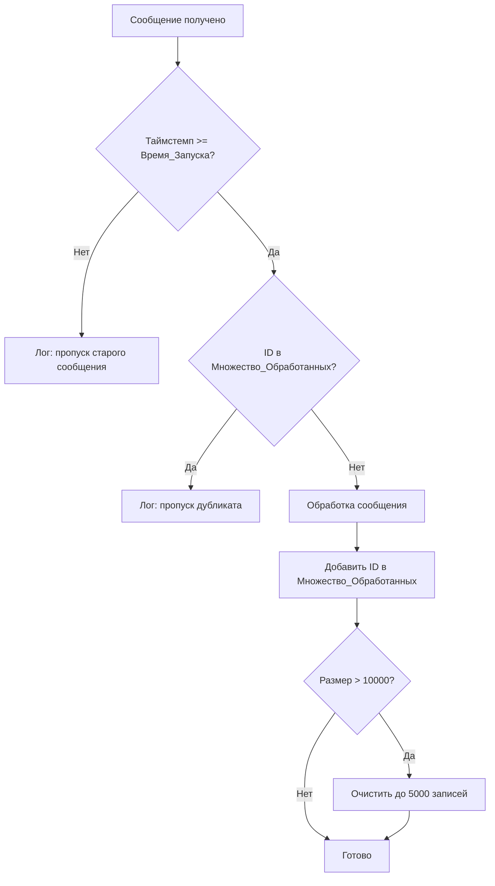

# Дизайн: Мониторинг только новых сообщений в реалтайм

## Обзор

Данный дизайн описывает добавление защитных механизмов в систему мониторинга «Пульс города Нижневартовск», гарантирующих обработку только новых сообщений, поступивших после запуска системы. Изменения затрагивают три файла: `start_monitoring.py`, `start_all_monitoring.py` и `services/vk_monitor_service.py`. Подход минимально инвазивный — добавляются проверки в существующие обработчики без изменения архитектуры.

## Архитектура

Изменения вносятся на уровне обработчиков сообщений. Новый поток обработки:



Ключевое решение: фильтрация по таймстемпу выполняется ДО дедупликации, чтобы не засорять множество обработанных ID старыми сообщениями.

## Компоненты и интерфейсы

### 1. Модуль `RealtimeGuard`

Вспомогательный класс, инкапсулирующий логику фильтрации. Используется во всех трёх файлах мониторинга.

```python
class RealtimeGuard:
    def __init__(self):
        self._startup_time: datetime  # UTC, фиксируется при создании
        self._processed_ids: OrderedDict  # (source, id) → timestamp, FIFO
        self._max_size: int = 10000
        self._trim_size: int = 5000
    
    def is_new_message(self, timestamp: datetime) -> bool:
        """Возвращает True если таймстемп >= время запуска"""
    
    def is_duplicate(self, source: str, message_id: int) -> bool:
        """Возвращает True если сообщение уже обработано"""
    
    def mark_processed(self, source: str, message_id: int) -> None:
        """Добавляет ID в множество обработанных, при необходимости очищает"""
    
    @property
    def startup_time(self) -> datetime:
        """Время запуска (UTC)"""
    
    @property
    def stats(self) -> dict:
        """Статистика: skipped_old, skipped_duplicate, processed_count"""
```

Решение использовать `OrderedDict` вместо `set` обусловлено необходимостью FIFO-очистки — при превышении лимита удаляются самые старые записи, а не произвольные.

### 2. Интеграция в Telegram-обработчики

В `start_monitoring.py` и `start_all_monitoring.py`:

```python
# При запуске (до регистрации обработчиков)
guard = RealtimeGuard()
logger.info(f"⏱️ Время запуска: {guard.startup_time.isoformat()}")

# В обработчике событий
async def handler(event):
    msg_time = event.message.date  # datetime, UTC (Telethon)
    if not guard.is_new_message(msg_time):
        logger.info(f"⏭️ Старое сообщение: @{event.chat.username}/{event.message.id}, время: {msg_time}")
        return
    
    source = f"tg:{event.chat.username}"
    if guard.is_duplicate(source, event.message.id):
        logger.debug(f"⏭️ Дубликат: @{event.chat.username}/{event.message.id}")
        return
    
    # ... существующая обработка ...
    
    guard.mark_processed(source, event.message.id)
```

### 3. Интеграция в VK-поллер

В `services/vk_monitor_service.py`:

```python
# Время запуска передаётся при инициализации или используется глобальный guard
def set_startup_time(startup_time: datetime) -> None:
    """Устанавливает время запуска для фильтрации постов"""

# В fetch_new_posts — дополнительная проверка таймстемпа
post_date = datetime.fromtimestamp(post.get("date", 0), tz=timezone.utc)
if post_date < startup_time:
    logger.info(f"⏭️ VK старый пост: {group_id}/{post_id}, дата: {post_date}")
    continue
```

## Модели данных

### RealtimeGuard — внутреннее состояние

```python
@dataclass
class GuardStats:
    skipped_old: int = 0        # Пропущено по таймстемпу
    skipped_duplicate: int = 0  # Пропущено как дубликат
    processed_count: int = 0    # Успешно обработано

class RealtimeGuard:
    _startup_time: datetime          # UTC, неизменяемое после создания
    _processed_ids: OrderedDict      # ключ: (source, msg_id), значение: timestamp
    _max_size: int                   # Максимальный размер множества (10000)
    _trim_size: int                  # Размер после очистки (5000)
    _stats: GuardStats               # Счётчики статистики
```

Ключ `(source, msg_id)` — кортеж из строки источника (`"tg:channel_name"` или `"vk:group_id"`) и числового ID сообщения. Это позволяет использовать единый guard для Telegram и VK без коллизий ID.


## Свойства корректности

*Свойство корректности — это характеристика или поведение, которое должно выполняться при всех допустимых исполнениях системы. Свойства служат мостом между человекочитаемыми спецификациями и машинно-проверяемыми гарантиями корректности.*

### Property 1: Корректность фильтрации по таймстемпу

*For any* datetime `startup_time` и *for any* datetime `msg_time`, метод `is_new_message(msg_time)` SHALL возвращать `True` тогда и только тогда, когда `msg_time >= startup_time`.

**Validates: Requirements 2.1, 2.2, 4.1, 4.2**

Обоснование: Требования 2.1/2.2 (Telegram) и 4.1/4.2 (VK) описывают одну и ту же логику фильтрации по таймстемпу. Поскольку используется единый метод `is_new_message`, одно свойство покрывает все четыре критерия. Это метаморфное свойство — результат зависит только от соотношения двух временных меток.

### Property 2: Раунд-трип дедупликации (mark → detect)

*For any* строки `source` и *for any* целого числа `message_id`, после вызова `mark_processed(source, message_id)` вызов `is_duplicate(source, message_id)` SHALL возвращать `True`.

**Validates: Requirements 3.2, 3.3**

Обоснование: Это классическое свойство раунд-трипа (insert/contains). Требование 3.3 говорит, что обработанные сообщения добавляются в множество, а 3.2 — что дубликаты обнаруживаются. Вместе они образуют пару операций, проверяемую одним свойством.

### Property 3: Инвариант размера множества обработанных

*For any* последовательности вызовов `mark_processed` произвольной длины, размер внутреннего `_processed_ids` SHALL не превышать `_max_size`.

**Validates: Requirements 3.4**

Обоснование: Это инвариант структуры данных. Независимо от количества обработанных сообщений, множество не должно расти бесконечно. После превышения `max_size` (10000) происходит очистка до `trim_size` (5000).

## Обработка ошибок

| Ситуация | Поведение |
|---|---|
| `event.message.date` равен `None` (Telethon) | Считать сообщение новым (пропустить проверку таймстемпа), записать предупреждение в лог |
| VK пост без поля `date` | Использовать `date=0`, что автоматически отфильтрует пост как старый |
| Ошибка при записи в лог | Не прерывать обработку сообщения |
| `_processed_ids` повреждён | Пересоздать пустой `OrderedDict`, записать ошибку в лог |

## Стратегия тестирования

### Библиотека для property-based тестирования

Используется **Hypothesis** для Python — зрелая PBT-библиотека с богатыми генераторами.

### Property-based тесты

Каждое свойство корректности реализуется одним property-based тестом с минимум 100 итерациями.

- **Property 1**: Генерируем случайные пары `(startup_time, msg_time)` через `hypothesis.strategies.datetimes()`. Проверяем, что `is_new_message` возвращает `msg_time >= startup_time`.
  - Tag: `Feature: realtime-only-monitoring, Property 1: Корректность фильтрации по таймстемпу`

- **Property 2**: Генерируем случайные `(source: str, message_id: int)` через `hypothesis.strategies.text()` и `integers()`. Вызываем `mark_processed`, затем проверяем `is_duplicate`.
  - Tag: `Feature: realtime-only-monitoring, Property 2: Раунд-трип дедупликации`

- **Property 3**: Генерируем список случайных `(source, message_id)` пар длиной от 0 до 20000. Вызываем `mark_processed` для каждой, после каждого вызова проверяем `len(_processed_ids) <= max_size`.
  - Tag: `Feature: realtime-only-monitoring, Property 3: Инвариант размера множества`

### Unit-тесты

Unit-тесты дополняют property-тесты конкретными примерами и edge-кейсами:

- Сообщение ровно в момент запуска (`msg_time == startup_time`) — должно быть принято
- Сообщение на 1 секунду раньше запуска — должно быть отклонено
- Дубликат с тем же `(source, id)` — `is_duplicate` возвращает `True`
- Новое сообщение с другим `source` но тем же `id` — не дубликат
- Очистка множества: после 10001 вставки размер <= 10000
- `startup_time` записывается в лог в формате ISO 8601
- Статистика `skipped_old` и `skipped_duplicate` корректно инкрементируется
