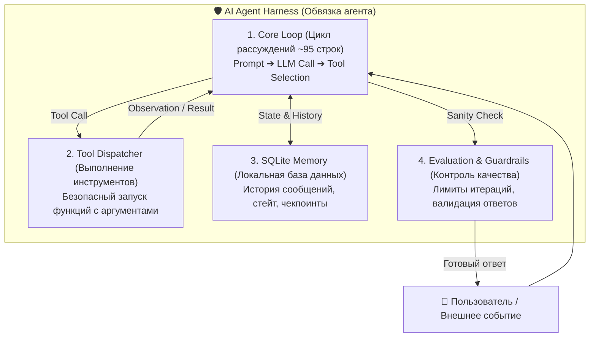

# 🎬 Пошаговый гайд: Архитектура ИИ-Агентов на реальном коде за 20 минут (Waku Agent)

**По материалам видео:** [Sean Chen — You Can Learn AI Agent Harness In Real Code In 20 Min | Loop](https://youtu.be/rvRyBhILrls?si=Q6sqBXcXXlUlKjlx)  
**Репозиторий проекта:** [ShenSeanChen/waku-agent (GitHub)](https://github.com/ShenSeanChen/waku-agent)  
**Уровень:** Для новичков и практикующих разработчиков  
**Язык:** Русский  

---

## 🧭 Введение: Почему фреймворки устарели, а Harness — это стандарт

Большинство популярных фреймворков для создания ИИ-агентов (LangChain, CrewAI, AutoGen) страдают от **оверинжиниринга**: тысяч строк абстракций, скрытых промптов и непредсказуемого поведения.

В этом видео Шон Чен (Sean Chen) наглядно показывает, что **настоящее ядро автономного ИИ-агента занимает всего ~95 строк чистого кода на Python**, а надежность строится вокруг концепции **Harness (Обвязки)**.



---

## 🧱 4 Столпа Архитектуры Waku Agent

### 1. Harness (Обвязка)
Контролирует жизненный цикл агента: управляет токенами, перехватывает ошибки выполнения инструментов и не позволяет агенту уйти в бесконечный цикл.

### 2. The Core Loop (Цикл Агента)
Классический паттерн **ReAct (Reasoning + Acting)**:
1. **Думать (Thought):** Агент анализирует пользовательский запрос и историю.
2. **Действовать (Action):** Агент выбирает инструмент (Tool) и генерирует JSON-параметры.
3. **Наблюдать (Observation):** Harness исполняет функцию и возвращает результат в контекст агента.
4. **Завершить (Final Output):** Когда инструмент возвращает финальный результат, цикл останавливается.

### 3. Local-First Memory (SQLite)
Вся память хранится в одном локальном файле `agent_memory.sqlite3`. Никаких сложных облачных сервисов:
- Таблица `threads` — диалоги и задачи.
- Таблица `messages` — история реплик и вызовов инструментов.
- Таблица `tool_calls` — аудит каждого вызова с таймстемпами.

### 4. Evaluation & Budgeting (Бюджетирование шагов)
Защита от «галлюцинаций» и бесконечных трат токенов: лимит на 10–15 шагов на одну задачу с автоматическим прерыванием при отсутствии прогресса.

---

## 🛠️ Пошаговый гайд: Развёртывание Waku Agent с нуля

### Шаг 1: Клонирование репозитория и установка
```bash
# Клонируем официальный репозиторий Waku Agent
git clone https://github.com/ShenSeanChen/waku-agent.git
cd waku-agent

# Создаем и активируем виртуальное окружение Python
python -m venv venv
# Для Windows:
venv\Scripts\activate
# Для Linux/macOS:
source venv/bin/activate

# Устанавливаем минимальные зависимости (без тяжелых библиотек)
pip install openai pydantic sqlite3-api requests
```

### Шаг 2: Настройка переменных окружения
Создайте файл `.env` в корне проекта:
```env
# Любой OpenAI-совместимый API (OpenRouter, TabiToken, OpenAI, LiteLLM)
OPENAI_API_KEY=your_api_key_here
OPENAI_BASE_URL=https://openrouter.ai/api/v1
MODEL_NAME=moonshotai/kimi-k3-free
```

---

### Шаг 3: Разбор 95 строк ядра агента (`agent_loop.py`)

Вот как устроен минимальный, прозрачный цикл агента:

```python
import json
import sqlite3
from openai import OpenAI

client = OpenAI()

# 1. Регистрация инструментов (Tools)
def get_weather(city: str) -> str:
    """Возвращает текущую погоду в городе."""
    return f"Погода в {city}: -8°C, ясно, ветер 4 м/с."

def search_web(query: str) -> str:
    """Ищет информацию в интернете."""
    return f"Результат поиска по '{query}': последние новости Нижневартовска."

TOOLS_MAP = {
    "get_weather": get_weather,
    "search_web": search_web,
}

TOOLS_SCHEMA = [
    {
        "type": "function",
        "function": {
            "name": "get_weather",
            "description": "Узнать погоду в городе",
            "parameters": {
                "type": "object",
                "properties": {"city": {"type": "string"}},
                "required": ["city"],
            },
        },
    },
    {
        "type": "function",
        "function": {
            "name": "search_web",
            "description": "Поиск в интернете",
            "parameters": {
                "type": "object",
                "properties": {"query": {"type": "string"}},
                "required": ["query"],
            },
        },
    },
]

# 2. Исполнительный цикл (The Loop)
def run_waku_agent(user_prompt: str, max_steps: int = 10) -> str:
    messages = [
        {"role": "system", "content": "Ты автономный помощник. Используй инструменты для решения задачи."},
        {"role": "user", "content": user_prompt},
    ]

    for step in range(max_steps):
        print(f"\n[Шаг {step + 1}/{max_steps}] Агент рассуждает...")
        response = client.chat.completions.create(
            model="moonshotai/kimi-k3-free",
            messages=messages,
            tools=TOOLS_SCHEMA,
            tool_choice="auto",
        )
        msg = response.choices[0].message
        messages.append(msg)

        # Если агент сформировал финальный ответ — возвращаем его
        if not msg.tool_calls:
            return msg.content

        # Исполнение вызванных инструментов
        for tool_call in msg.tool_calls:
            fn_name = tool_call.function.name
            args = json.loads(tool_call.function.arguments)
            print(f"  -> Вызов инструмента: {fn_name}({args})")

            # Безопасный вызов из реестра
            if fn_name in TOOLS_MAP:
                result = TOOLS_MAP[fn_name](**args)
            else:
                result = f"Ошибка: инструмент {fn_name} не найден."

            # Возвращаем Observation обратно в диалог
            messages.append({
                "role": "tool",
                "tool_call_id": tool_call.id,
                "content": str(result),
            })

    return "Превышен лимит шагов выполнения задачи."
```

---

### Шаг 4: Добавление памяти (SQLite) за 1 минуту

```python
def init_memory():
    conn = sqlite3.connect("waku_memory.db")
    cur = conn.cursor()
    cur.execute("""
        CREATE TABLE IF NOT EXISTS history (
            id INTEGER PRIMARY KEY AUTOINCREMENT,
            role TEXT,
            content TEXT,
            timestamp DATETIME DEFAULT CURRENT_TIMESTAMP
        )
    """)
    conn.commit()
    conn.close()

def save_message(role: str, content: str):
    conn = sqlite3.connect("waku_memory.db")
    cur = conn.cursor()
    cur.execute("INSERT INTO history (role, content) VALUES (?, ?)", (role, str(content)))
    conn.commit()
    conn.close()
```

---

## 🎯 Сравнение подходов

| Параметр | Тяжелые фреймворки (LangChain/CrewAI) | Waku Agent Harness Pattern |
|---|---|---|
| **Размер кодовой базы** | 100 000+ строк | **< 100 строк** |
| **Отладка и прозрачность** | Трудный поиск в дебрях колбэков | **100% прозрачный print/log** |
| **Хранилище данных** | Сложные облачные БД / вектроные базы | **Один локальный SQLite файл** |
| **Потребление ресурсов** | Высокое (десятки обёрток) | **Мгновенный старт, 0 MB оверхеда** |
| **Поддержка любых LLM** | Нужны специфичные адаптеры | **Любой OpenAI-совместимый эндпоинт** |

---

## 🔗 Полезные ссылки и ресурсы
1. 📺 **Видео на YouTube:** [Sean Chen — You Can Learn AI Agent Harness In Real Code In 20 Min](https://youtu.be/rvRyBhILrls?si=Q6sqBXcXXlUlKjlx)
2. 💻 **GitHub Репозиторий:** [https://github.com/ShenSeanChen/waku-agent](https://github.com/ShenSeanChen/waku-agent)
3. 🧠 **Nous Hermes Agent Docs:** [https://hermes-agent.nousresearch.com/docs/skills](https://hermes-agent.nousresearch.com/docs/skills)
4. 🌐 **Agent-Reach (OSINT):** [https://github.com/Panniantong/Agent-Reach](https://github.com/Panniantong/Agent-Reach)
5. 📑 **Firecrawl PDF Inspector:** [https://github.com/firecrawl/pdf-inspector](https://github.com/firecrawl/pdf-inspector)
